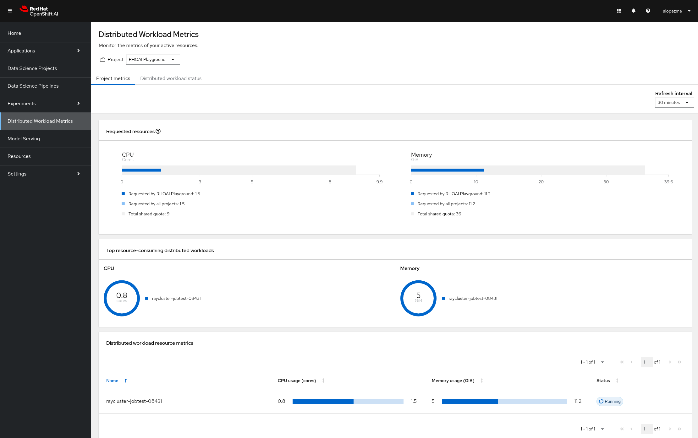
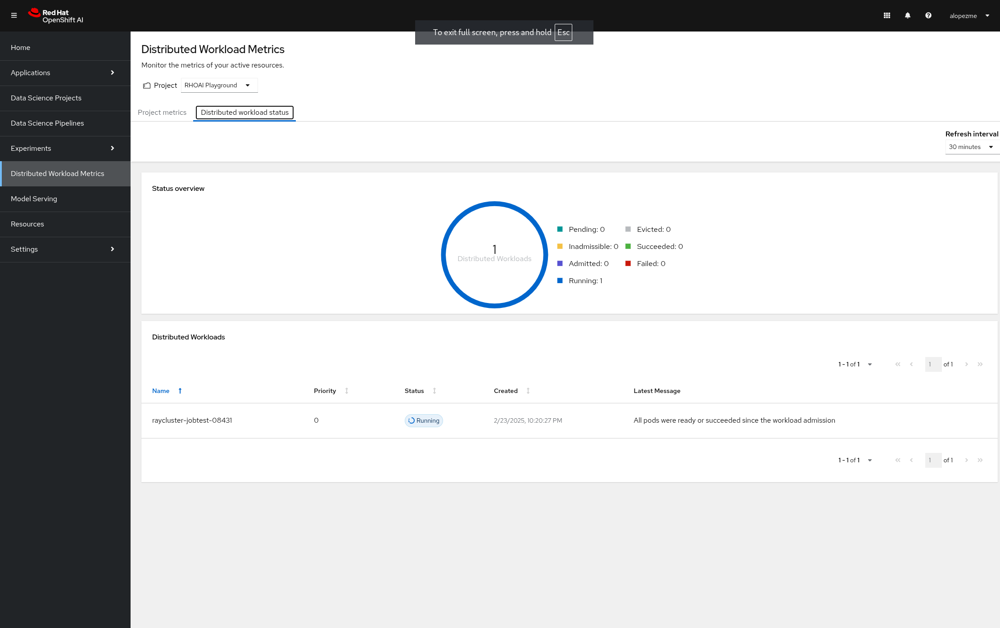
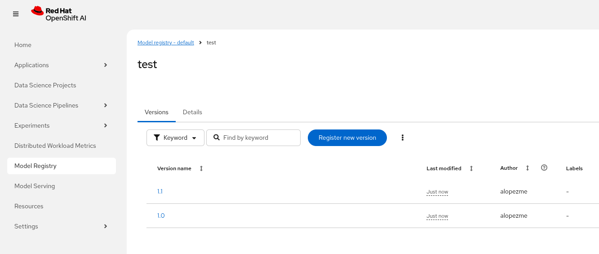

# Red Hat OpenShift AI

**Álvaro López Medina** — [alopezme@redhat.com](mailto:alopezme@redhat.com)  
*v1.0, 2024-03*

Red Hat OpenShift AI (RHOAI) is OpenShift’s enterprise AI/MLOps platform for the full model lifecycle—train, serve, monitor, and govern. This repo is my playground to deploy and try its main features.

## Table of contents

1. [Red Hat OpenShift AI](#red-hat-openshift-ai)
   1. [Table of contents](#table-of-contents)
   2. [Red Hat Training](#red-hat-training)
   3. [RHOAI Architecture](#rhoai-architecture)
      1. [DataScienceCluster components](#datasciencecluster-components)
   4. [Installation](#installation)
      1. [Installation on non-4.21 OCP](#installation-on-non-421-ocp)
      2. [Let's install!!](#lets-install)
   5. [Things you should know!](#things-you-should-know)
      1. [NVIDIA GPU nodes](#nvidia-gpu-nodes)
      2. [NVIDIA GPU partitioning](#nvidia-gpu-partitioning)
      3. [Pipeline S3 storage](#pipeline-s3-storage)
      4. [Managing distributed workloads](#managing-distributed-workloads)
      5. [Model Registry](#model-registry)
   6. [Monitoring, Safety and Evaluation](#monitoring-safety-and-evaluation)
   7. [Deploying models (inference serving)](#deploying-models-inference-serving)
   8. [Extra Components](#extra-components)
      1. [MinIO](#minio)
      2. [Open WebUI](#open-webui)
      3. [Milvus](#milvus)
      4. [Langfuse](#langfuse)
   9. [Extra documentation](#extra-documentation)
      1. [Useful links](#useful-links)
      2. [Study sources](#study-sources)
      3. [Nice demos and projects to take a look](#nice-demos-and-projects-to-take-a-look)

## Red Hat Training

RHOAI evolves quickly, so **this repo may become outdated**. For the latest product behavior, use the [official documentation](https://docs.redhat.com/en/documentation/red_hat_openshift_ai_self-managed/3.4).

Hands-on learning is consolidated in one course: **AI267** — *Developing and Deploying AI/ML Applications on Red Hat OpenShift AI* (projects, notebooks, training, serving, pipelines, and administration). See [Red Hat Training](https://role.rhu.redhat.com/rol-rhu/app) for schedules and labs.

## RHOAI Architecture

The following diagram depicts the general architecture of a RHOAI deployment, including the most important components:


### DataScienceCluster components

This repo configures `DataScienceCluster` in `rhoai-installation-chart/templates/02-rhoai-configuration/DataScienceCluster.yaml`:

| Component | Purpose | Default in this repo |
|-----------|---------|----------------------|
| dashboard | RHOAI dashboard | Managed |
| workbenches | Notebook/IDE workbenches (`rhods-notebooks`) | Managed |
| aipipelines | Kubeflow Pipelines + embedded Argo Workflows | Managed |
| kserve | Model serving (KServe RawDeployment, NIM; optional Models-as-a-Service) | Managed |
| ray | Distributed Ray workloads | Managed |
| trainingoperator | Distributed training (PyTorch, TensorFlow, MPI) | Managed |
| kueue | Queues for distributed workloads (operator installed separately) | Unmanaged if `distributedWorkloads.enabled` |
| modelregistry | Central model catalog (`rhoai-model-registries`) | Managed if `modelRegistry.enabled` |
| trustyai | Bias, drift, guardrails, LM-Eval | Managed if `trustyai.enabled` |
| feastoperator | Feast feature store | Managed if `featureStore.enabled` |
| mlflowoperator | MLflow tracking | Managed if `mlflow.enabled` |
| llamastackoperator | Llama Stack RAG/agent APIs | Managed if `llamaStack.enabled` |

## Installation

RHOAI needs GPU infrastructure, platform operators, object storage, and a `DataScienceCluster` configuration. Use `auto-install.sh` to apply the Argo CD applications in order.

**Prerequisites:** `oc` login, OpenShift GitOps (Argo CD) on the cluster, and enough memory on untainted workers (checked against `REQUIRED_MEMORY_Gi`, default 70 Gi).

Edit the toggles at the top of `auto-install.sh` to skip steps you do not need. By default the script:

1. *(Optional)* Provisions AWS GPU worker MachineSets when `GPU_NODE_COUNT` > 0 (`AWS_GPU_INSTANCE`, default `g6.2xlarge`; nodes are GPU-tainted).
2. Deploys dependencies via `application-rhoai-dependencies.yaml` (NVIDIA GPU stack, Kueue, Leader Worker Set, JobSet, RHCL, KEDA) and enables the NVIDIA GPU console plugin.
3. *(Optional)* Installs OpenShift Pipelines (`INSTALL_PIPELINES`) and S3 storage: MinIO and S4 (`INSTALL_MINIO`, `INSTALL_S4`), including a playground bucket when `CREATE_RHOAI_ENV=true`.
4. *(Optional)* Installs ODF in MCG mode (`INSTALL_ODF`, off by default) or user-workload monitoring (`INSTALL_MONITORING`, off by default).
5. Waits for GPU nodes when `GPU_NODE_COUNT` > 0, then installs RHOAI via `application-rhoai-installation.yaml` (operator + Helm chart defaults: model registry, distributed workloads, TrustyAI, Feast, MLflow, Llama Stack, llm-d, and related settings).
6. *(Optional)* Deploys the RHOAI Playground project (`CREATE_RHOAI_ENV`) and Langfuse when `INSTALL_LANGFUSE` is enabled (requires MinIO).

If you plan to use GPU nodes on AWS, the script also prints the Service Quotas commands to request and check the Running On-Demand G and VT instances limit.

### Installation on non-4.21 OCP

Some of the components deployed in this repo are bound to an specific version of OpenShift. If you want to deploy RHOAI on an older version (For example 4.20), you have to make the following modifications:

- Change the channel of ODF:
  - In `./ocp-odf/odf-operator/sub-odf-operator.yaml`, the value of `.spec.channel` field should be `stable-4.20`.

### Let's install!!

> [!TIP]
> The script contains many tasks divided in clear blocks with comments. Use the Environment Variables or add comments to disable those that you are not interested in.

In order to automate it all, it relays on OpenShift GitOps (ArgoCD), so you will to have it installed before executing the following script. Check out my automated installation on [alvarolop/ocp-gitops-playground](https://github.com/alvarolop/ocp-gitops-playground) GitHub repository.

Now, log in to the cluster and just execute the script:

```bash
./auto-install.sh
```

## Things you should know!

### NVIDIA GPU nodes

Most of the activities related to RHOAI will require GPU Acceleration. For that purpose, we add NVIDIA GPU nodes during the installation process. In this chapter, I collect some information that might be useful for you.

In this automation, we are currently using the AWS `g6.2xlarge` instance (see `AWS_GPU_INSTANCE` in `auto-install.sh`). According to the documentation:

> Amazon EC2 G6 instances are designed to accelerate graphics-intensive applications and machine learning inference. They can also be used to train simple to moderately complex machine learning models.

#### How to know that a node has NVIDIA GPUs using NodeFeatureDiscovery?

The output of the following command will only be visible when you have applied the ArgoCD `Application` and the Node Feature Discovery operator has scanned the OpenShift nodes:

```bash
oc describe node | egrep 'Roles|pci'
Roles:              control-plane,master
Roles:              worker
                    feature.node.kubernetes.io/pci-1d0f.present=true
Roles:              gpu-worker,worker
                    feature.node.kubernetes.io/pci-10de.present=true
                    feature.node.kubernetes.io/pci-1d0f.present=true
Roles:              control-plane,master
Roles:              control-plane,master
```

`pci-10de` is the PCI vendor ID that is assigned to NVIDIA.

The NVIDIA GPU Operator automates the management of all NVIDIA software components needed to provision GPU. These components include the NVIDIA drivers (to enable CUDA), Kubernetes device plugin for GPUs, the NVIDIA Container Runtime, automatic node labelling, DCGM based monitoring and others.

After configuring the Node Feature Discovery Operator and the NVidia GPU Operator using GitOps, you need to confirm that the Nvidia operator is correctly retrieving the GPU information. You can use the following command to confirm that OpenShift is correctly configured:

```bash
# Simple command - gets first pod (may not match node order)
oc exec -it -n nvidia-gpu-operator $(oc get pod -o wide -l openshift.driver-toolkit=true -o jsonpath="{.items[0].metadata.name}" -n nvidia-gpu-operator) -- nvidia-smi

# More precise - filter by node number (0, 1, 2, etc.)
# For node 0:
oc exec -it -n nvidia-gpu-operator $(oc get pod -l openshift.driver-toolkit=true -o name -n nvidia-gpu-operator | grep '\-0$' | head -1 | cut -d'/' -f2) -- nvidia-smi
# For node 1:
oc exec -it -n nvidia-gpu-operator $(oc get pod -l openshift.driver-toolkit=true -o name -n nvidia-gpu-operator | grep '\-1$' | head -1 | cut -d'/' -f2) -- nvidia-smi
# For node 2:
oc exec -it -n nvidia-gpu-operator $(oc get pod -l openshift.driver-toolkit=true -o name -n nvidia-gpu-operator | grep '\-2$' | head -1 | cut -d'/' -f2) -- nvidia-smi
```

The output should look like this:

```bash
Wed Apr 29 22:08:43 2026
+-----------------------------------------------------------------------------------------+
| NVIDIA-SMI 580.126.20             Driver Version: 580.126.20     CUDA Version: 13.0     |
+-----------------------------------------+------------------------+----------------------+
| GPU  Name                 Persistence-M | Bus-Id          Disp.A | Volatile Uncorr. ECC |
| Fan  Temp   Perf          Pwr:Usage/Cap |           Memory-Usage | GPU-Util  Compute M. |
|                                         |                        |               MIG M. |
|=========================================+========================+======================|
|   0  NVIDIA L4                      On  |   00000000:35:00.0 Off |                    0 |
| N/A   56C    P0             37W /   72W |   20002MiB /  23034MiB |      0%      Default |
|                                         |                        |                  N/A |
+-----------------------------------------+------------------------+----------------------+

+-----------------------------------------------------------------------------------------+
| Processes:                                                                              |
|  GPU   GI   CI              PID   Type   Process name                        GPU Memory |
|        ID   ID                                                               Usage      |
|=========================================================================================|
|    0   N/A  N/A           64510      C   VLLM::EngineCore                      19994MiB |
+-----------------------------------------------------------------------------------------+
```

If, for some race condition, RHOAI is not detecting that GPU worker, you might need to force it to recalculate. You can do so easily with the following command:

```bash
oc delete cm migration-gpu-status -n redhat-ods-applications; sleep 3; oc delete pods -l app=rhods-dashboard -n redhat-ods-applications
```

Wait for a few seconds until the dashboard pods start again and you will see in the RHOAI web console that now the `NVidia GPU` Accelerator Profile is listed.

### NVIDIA GPU partitioning

This repo does not enable time-slicing or MIG by default; options depend on your GPU model and what the NVIDIA GPU Operator supports. Before changing `rhoai-dependencies/operator-nvidia-gpu`, read:

- [GPU partitioning guide](https://github.com/rh-aiservices-bu/gpu-partitioning-guide) (Red Hat AI Services BU)
- [Sharing is caring: How to make the most of your GPUs (part 1 — time-slicing)](https://www.redhat.com/en/blog/sharing-caring-how-make-most-your-gpus-part-1-time-slicing)
- [Sharing is caring: How to make the most of your GPUs (part 2 — Multi-instance GPU)](https://www.redhat.com/en/blog/sharing-caring-how-make-most-your-gpus-part-2-multi-instance-gpu)

### Pipeline S3 storage

Pipelines need S3-compatible storage for artifacts. With the default `auto-install.sh` settings (`INSTALL_MINIO=true`, `CREATE_RHOAI_ENV=true`), MinIO is deployed and `create-minio-s3-bucket.sh` creates the bucket and dashboard connection secret—no manual step.

For AWS S3, ODF/NooBaa, or a custom endpoint, use the scripts and templates under `prerequisites/s3-bucket/` (see `aws-env-vars.example` for AWS).

### Managing distributed workloads

You can use the distributed workloads feature to queue, scale, and manage the resources required to run data science workloads across multiple nodes in an OpenShift cluster simultaneously. These three components need to be enabled on the RHOAI installation configuration:

- **CodeFlare**: Secures deployed Ray clusters and grants access to their URLs.
- **KubeRay**: Manages remote Ray clusters on OpenShift for running distributed compute workloads.
- **Kueue**: Manages quotas and how distributed workloads consume them, and manages the queueing of distributed workloads with respect to quotas.

If you want to try this feature, I recommend you to follow the RH documentation, which points to the following [Guided Demos](https://github.com/project-codeflare/codeflare-sdk/tree/main/demo-notebooks/guided-demos).

- Documentation: [Installation guide](https://docs.redhat.com/en/documentation/red_hat_openshift_ai_self-managed/3.4/html-single/installing_and_uninstalling_openshift_ai_self-managed/index#updating-installation-status-of-openshift-ai-components-using-web-console_component-install).
- Documentation: [Configuration guide](https://docs.redhat.com/en/documentation/red_hat_openshift_ai_self-managed/3.4/html/managing_openshift_ai/managing-distributed-workloads_managing-rhoai).
- Documentation: [Usage guide](https://docs.redhat.com/en/documentation/red_hat_openshift_ai_self-managed/3.4/html/working_with_distributed_workloads).

After everything is configured, you can use the Model Tunning example from the Helm chart to see some stats:

```bash
helm template ./rhoai-environment-chart \
    -s templates/modelTunning/cm-training-config.yaml \
    -s templates/modelTunning/cm-twitter-complaints.yaml \
    -s templates/modelTunning/pvc-trained-model.yaml \
    -s templates/modelTunning/pytorchjob-demo.yaml \
    --set modelTunning.enabled=true | oc apply -f -
```

You can also see some stats from the RHOAI dasboard:





### Model Registry

OpenShift AI now includes the possibility to deploy a model registry to store community and customized AI models. This model registry uses a `mysql` database as backend to store metadata and artifacts from your applications. Once deployed, your training pipelines can add an extra step putting model metadata to the registry.

Using RHOAI Model Registry you have a centralized source of models as well as a simple way to deploy prepared models:



Here you can find examples of REST requests to query model metadata:

```bash
MODEL_REGISTRY_NAME=default
MODEL_REGISTRY_HOST=$(oc get route default-https -n rhoai-model-registries -o go-template='https://{{.spec.host}}')
TOKEN=$(oc whoami -t)

# List models
curl -s "$MODEL_REGISTRY_HOST/api/model_registry/v1alpha3/registered_models?pageSize=100&orderBy=ID&sortOrder=DESC" \
  -H "accept: application/json" \
  -H "Authorization: Bearer ${TOKEN}" | jq .

# List all model versions 
MODEL_NAME="test"
MODEL_ID="4"

curl -s "$MODEL_REGISTRY_HOST/api/model_registry/v1alpha3/registered_model?name=${MODEL_NAME}&externalId=${MODEL_ID}" \
  -H "accept: application/json" \
  -H "Authorization: Bearer ${TOKEN}" | jq .

curl -s "$MODEL_REGISTRY_HOST/api/model_registry/v1alpha/registered_models/${MODEL_ID}/versions?name=${MODEL_NAME}&pageSize=100&orderBy=ID&sortOrder=DESC" \
  -H "accept: application/json" \
  -H "Authorization: Bearer ${TOKEN}" | jq .
```

If you want to try this feature, I recommend you to follow the RH documentation:

- Documentation step 1: [Enabling the model registry component](https://docs.redhat.com/en/documentation/red_hat_openshift_ai_self-managed/3.4/html/managing_model_registries/enabling-the-model-registry-component_managing-model-registries).
- Documentation step 2: [Managing model registries](https://docs.redhat.com/en/documentation/red_hat_openshift_ai_self-managed/3.4/html/managing_model_registries).
- Documentation step 3: [Working with model registries](https://docs.redhat.com/en/documentation/red_hat_openshift_ai_self-managed/3.4/html/working_with_model_registries).

## Monitoring, Safety and Evaluation

- **[Monitoring](https://docs.redhat.com/en/documentation/red_hat_openshift_ai_self-managed/3.4/html-single/monitoring_your_ai_systems/index)**: To ensure the transparency, fairness, and reliability of your data science models in OpenShift AI for *Bias* and *Data Drift*. Configure and set up TrustyAI for your project, and then perform the following checks:
  - **Bias**: Check for unfair patterns or biases in data and model predictions to ensure your model's decisions are unbiased.
  - **Data drift**: Detect changes in input data distributions over time by comparing the latest real-world data to the original training data. Comparing the data identifies shifts or deviations that could impact model performance, ensuring that the model remains accurate and reliable.

- **[Safety](https://docs.redhat.com/en/documentation/red_hat_openshift_ai_self-managed/3.4/html-single/enabling_ai_safety_with_guardrails/index)**: To ensure that your machine-learning models are transparent, fair, and reliable. The TrustyAI Guardrails Orchestrator service is a tool to invoke detections on text generation inputs and outputs, as well as standalone detections.

- **[Evaluation](https://docs.redhat.com/en/documentation/red_hat_openshift_ai_self-managed/3.4/html-single/evaluating_ai_systems/index)**: To ensure your OpenShift AI models for accuracy, relevance, and consistency. Evaluate your AI systems to generate an analysis of your model's ability by using the following TrustyAI tools:
  - **LM-Eval**: Use TrustyAI to monitor your LLM against a range of different evaluation tasks and to ensure the accuracy and quality of its output. Features such as summarization, language toxicity, and question-answering accuracy are assessed to inform and improve your model parameters.
  - **RAGAS**: Use Retrieval-Augmented Generation Assessment (RAGAS) with TrustyAI to measure and improve the quality of your RAG systems in OpenShift AI. RAGAS provides objective metrics that assess retrieval quality, answer relevance, and factual consistency.
  - **Llama Stack**: Use Llama Stack components and providers with TrustyAI to evaluate and work with LLMs.

- **[GuideLLM](https://github.com/vllm-project/guidellm)**: A platform for evaluating how language models perform under real workloads and configurations. It is part of the vLLM project and is a tool for evaluating the performance of language models.

## Deploying models (inference serving)

Model serving (predictive and generative workloads, Argo CD applications, Helm chart, and curl/testing examples) lives in the separate [rhoai-serving](https://github.com/alvarolop/rhoai-serving) repository. Use that repo after this one has installed RHOAI and its dependencies.

## Extra Components

### MinIO

This demo is fully oriented to use the default and production ready capabilities provided by OpenShift. However, if your current deployment already uses minio and you cannot change it, you can optionally deploy a MinIO application in a side namespace using the following ArgoCD application. **This application is included in the `auto-install.sh` automation**:

```bash
cat application-minio.yaml | \
    CLUSTER_DOMAIN=$(oc get dns.config/cluster -o jsonpath='{.spec.baseDomain}') \
    MINIO_NAMESPACE="minio" MINIO_SERVICE_NAME="minio" \
    MINIO_ADMIN_USERNAME="minio" MINIO_ADMIN_PASSWORD="minio123" \
    envsubst | oc apply -f -
```

or you can deploy it manually with the following command:

```bash
helm template components/minio \
    --set clusterDomain=$(oc get dns.config/cluster -o jsonpath='{.spec.baseDomain}') \
    --set namespace="minio" --set service.name="minio" \
    --set adminUser.username="minio" --set adminUser.password="minio123" | oc apply -f -
```

User and password is `minio` / `minio123`.

- [Configure MinIO buckets (GitOps collection)](https://blog.stderr.at/gitopscollection/2024-05-17-configure-minio-buckets/)
- [Red Hat AI Services MinIO Helm chart](https://github.com/redhat-ai-services/helm-charts/tree/main/charts/minio)

### Open WebUI

Open WebUI is an extensible, feature-rich, and user-friendly self-hosted AI platform designed to operate entirely offline. It supports various LLM runners like Ollama and OpenAI-compatible APIs, with built-in inference engine for RAG, making it a powerful AI deployment solution.

**Configuration:** [`application-open-webui.yaml`](./application-open-webui.yaml)  
**Helm Chart:** [official Open WebUI Helm chart](https://github.com/open-webui/helm-charts/tree/main/charts/open-webui)

> [!NOTE]
> Model API configuration uses Helm chart's `openaiBaseApiUrls` and `openaiApiKeys` arrays:
> - **Default Model URL**: `gpt-oss-20b` service in `model-gpt-oss` namespace
> - **Default API Key**: `"not-needed"` (authentication disabled)
> - **Admin Account**: First user to sign up automatically becomes admin
> - **User Signup**: Configured via `ENABLE_SIGNUP: "true"` + `ENABLE_PERSISTENT_CONFIG: "false"`
>   - ⚠️ **Known Bug**: [Issue #20389](https://github.com/open-webui/open-webui/issues/20389)
>   - Even with correct env vars, signup button may disappear after first user
>   - **Workaround**: Manually enable "Enable New Sign Ups" in Admin Panel → Settings → General → Authentication
> - **Default User Role**: New users get `"user"` role (non-admin)
> 
> Override defaults using environment variables from your Fedora system:

```bash
cat application-open-webui.yaml | \
    OPENAI_API_URL=$OPENAI_API_URL \
    OPENAI_API_KEY=$OPENAI_API_KEY \
    envsubst | oc apply -f -
```

### Milvus

**Milvus** is Vector database built for scalable similarity search. It is "Open-source, highly scalable, and blazing fast". Milvus offers robust data modeling capabilities, enabling you to organize your unstructured or multi-modal data into structured collections.

**Attu** is an efficient open-source management tool for Milvus. It features an intuitive graphical user interface (GUI), allowing you to easily interact with your databases.

[Source](https://github.com/rh-aiservices-bu/llm-on-openshift/blob/main/vector-databases/milvus/milvus_manifest_standalone.yaml)

```bash
cat application-milvus.yaml | \
    CLUSTER_DOMAIN=$(oc get dns.config/cluster -o jsonpath='{.spec.baseDomain}') \
    envsubst | oc apply -f -
```

or you can deploy it manually with the following command:

```bash
helm template components/milvus --namespace="milvus" \
    --set clusterDomain=$(oc get dns.config/cluster -o jsonpath='{.spec.baseDomain}') | oc apply -f -
```

The password for the Attu GUI is `root` / `Milvus`.

### Langfuse

[Langfuse](https://langfuse.com/self-hosting/deployment/kubernetes-helm) is an open-source platform for tracing, logging, and monitoring AI applications. It provides a unified view of your AI pipeline, allowing you to troubleshoot issues, optimize performance, and improve reliability.

```bash
oc apply -f application-langfuse.yaml
```

or you can deploy it manually with the following command:

```bash
helm repo add langfuse https://langfuse.github.io/langfuse-k8s
helm repo update

helm install langfuse langfuse/langfuse -n langfuse --create-namespace
```

## Extra documentation

### Useful links

- [Official documentation](https://docs.redhat.com/en/documentation/red_hat_openshift_ai_self-managed/3.4).
- [KCS: Red Hat OpenShift AI Service Definition](https://access.redhat.com/support/policy/updates/rhoai/service).
- [rhoai-on-rhdh-template](https://github.com/stefan-bergstein/rhoai-on-rhdh-template/tree/main/manifests/helm/ds-project)
- [OpenShift AI CLI](https://github.com/stratus-ss/openshift-ai/blob/main/docs/rendered/OpenShift_AI_CLI.md)
- [RHOAIENG issues](https://issues.redhat.com/projects/RHOAIENG/issues)
- [os-mlops manifests](https://github.com/mamurak/os-mlops/tree/main/manifests/odh)
- [RHOAI supported configs](https://access.redhat.com/articles/rhoai-supported-configs)
- Getting started: [Getting started with Red Hat OpenShift AI](https://docs.redhat.com/en/documentation/red_hat_openshift_ai_self-managed/3.4/html/getting_started_with_red_hat_openshift_ai_self-managed)
- Monitoring: [Monitoring your AI systems](https://docs.redhat.com/en/documentation/red_hat_openshift_ai_self-managed/3.4/html-single/monitoring_your_ai_systems/index)
- DS Pipelines: [Working with AI pipelines](https://docs.redhat.com/en/documentation/red_hat_openshift_ai_self-managed/3.4/html/working_with_ai_pipelines)

### Study sources

- [rhods-admin](https://redhatquickcourses.github.io/rhods-admin/rhods-admin/1.33)
- [rhods-intro](https://redhatquickcourses.github.io/rhods-intro/rhods-intro/1.33)
- [rhods-model](https://redhatquickcourses.github.io/rhods-model/rhods-model/1.33)
- [Insurance claim processing workbench](https://rh-aiservices-bu.github.io/insurance-claim-processing/modules/02-03-creating-workbench.html)
- [Red Hat OpenShift AI getting started](https://developers.redhat.com/products/red-hat-openshift-ai/getting-started)

### Nice demos and projects to take a look

- [doc-bot](https://github.com/alpha-hack-program/doc-bot)
- [ai-studio-rhoai](https://github.com/alpha-hack-program/ai-studio-rhoai/tree/main)
- [mlops](https://github.com/davidseve/mlops/tree/main)
- [hobbyist-guide-to-rhoai — distributed workloads demo](https://github.com/redhat-na-ssa/hobbyist-guide-to-rhoai/blob/main/docs/10-demo-distributed_workloads.md)
